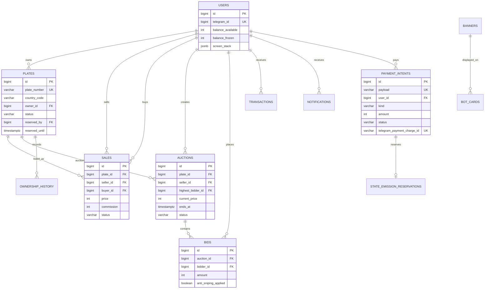

# CPM2 Plates Market — ER model

The PostgreSQL database is the transactional source of truth. `SELECT … FOR UPDATE` locks
the affected plate, auction, payment intent, and wallet rows inside each command transaction.
Redis stores only aiogram FSM state; it never stores balances or ownership.
